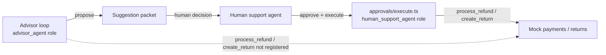

# Mercury Market Track 2 — Human-in-the-Loop Support Advisor & CI Governance

An internal assistant that helps human support agents resolve returns,
billing disputes, and refund requests for a mocked ecommerce retailer. The
advisor analyzes a case, retrieves authorized data, evaluates policy, and
produces a schema-validated **suggestion packet** — it never executes a
customer-affecting action itself. A separate, narrowly-scoped human-approval
and execution workflow is the only path that can move money or change an
order. CI/CD governance checks (deterministic first, model-assisted second)
gate changes to policies, prompts, tool descriptions, schemas, and
permissions.

This repository was cloned from a separate, completed Track 1 baseline
(`/Users/xl/mercury-market`, generalized here as such — see
`docs/track2-baseline.md` for the exact commit) and rebuilt as a standalone
platform. It is **not** a dual-mode Track 1/Track 2 repository — there is no
autonomous-execution runtime path anywhere in this codebase. Track 1 is
maintained separately and was not modified.

All data is synthetic. No production credentials belong anywhere in this
repository.

## Architecture summary



- **Multi-pass advisor**: facts → per-issue specialists (identity, order,
  policy, resolution-proposal) → cross-issue integration → precision review
  → suggestion packet, or escalation. See `docs/track2-architecture.md`.
- **Structural safety boundary**: the advisor's MCP connection is
  permanently bound to the `advisor_agent` role, which cannot even see
  `process_refund`/`create_return` in its tool list, let alone call them.
  Only `src/approvals/execute.ts` ever opens a `human_support_agent`
  connection, and only after verifying an exact-hash-matched approval. See
  the root `CLAUDE.md`'s "The safety boundary" section.
- **Versioned, hash-stamped approval**: every suggestion and proposed action
  carries a SHA-256 content hash; a material edit invalidates prior
  approval. See `docs/human-approval.md`.
- **CI governance**: deterministic policy/permission/hash checks always run;
  a model-assisted semantic pass runs only if the `claude` CLI is present
  (it is not, in this project's dev sandbox — see `docs/ci-governance.md`).

## Prerequisites

- Node.js ≥ 20
- No `ANTHROPIC_API_KEY` required for `npm test`, `npm run typecheck`, the
  MCP server, or most of the demo CLI (`demo-seed`, `approve`, `edit`,
  `reject`, `execute`, `audit`, `governance`). A key is needed only for
  `advisor:cli -- submit`, which drives the real advisor loop.

## Installation

```bash
npm install
```

## Environment variables

Copy `.env.example` to `.env` and adjust as needed — see that file for a
documented list (`MERCURY_REFUND_LIMIT_USD`, `MERCURY_ADVISOR_CONFIDENCE_THRESHOLD`,
`MERCURY_MAX_AGENT_STEPS`, `MERCURY_MAX_RETRIES`, `MERCURY_MAX_OUTPUT_RETRIES`,
`MERCURY_ENV`, `MERCURY_DB_PATH`, `MERCURY_LOG_LEVEL`, and the optional
`ANTHROPIC_API_KEY`).

## MCP server

```bash
npm run mcp:server
```

Starts the stdio MCP server (registered in `.mcp.json`) bound to the
`advisor_agent` role — usable from Claude Code or any MCP client. Tool
visibility is role-scoped: this connection's `listTools()` never includes
`process_refund`/`create_return`.

## Advisor CLI

```bash
npx tsx src/cli/index.ts                 # prints the full command list
npx tsx src/cli/index.ts demo-seed       # build a real suggestion packet, zero credentials
```

See `docs/demo-guide.md` for a full, verified walkthrough (approval,
execution, edit-invalidates-approval, policy conflict, blocked
direct-execution attempt, local governance run).

## Human approval workflow

`approve` / `edit` / `reject` / `revise` / `comment` / `execute` — see
`docs/human-approval.md` for the state machine, hashing scheme, and
replay/fork guards.

## CI checks

```bash
npm run governance:ci
```

See `.github/workflows/track2-governance.yml` and `docs/ci-governance.md`.

## Tests

```bash
npm run typecheck
npm test
```

78 tests across `tests/{unit,integration,scenarios,governance,security}/`,
all offline (no live API calls). See `docs/track2-migration.md` for exactly
what's covered and what's explicitly deferred.

## Example interaction

```
$ npx tsx src/cli/index.ts demo-seed
Seeded suggestion packet "suggestion_..." for case "case_demo_001" (eligible).
{ "schemaVersion": "1.0", "suggestionId": "...", "proposedActions": [{ "actionType": "propose_refund", "executionStatus": "awaiting_approval", ... }], ... }

$ npx tsx src/cli/index.ts approve suggestion_... action_1 human_agent_42 "Looks correct"
$ npx tsx src/cli/index.ts execute suggestion_... action_1 human_agent_42
{ "ok": true, "transactionId": "txn_9101" }
```

## Limitations (read before relying on this for anything beyond the demo)

- This is Phase 1 of a much larger specification. It implements the full
  architectural safety boundary and a representative slice of the spec's 46
  named scenario tests (see `docs/track2-migration.md` for exactly which
  are covered vs. deferred) — not literal 46/46 coverage.
- The `claude` CLI is not installed in this project's development sandbox,
  so the model-assisted CI review path has never been exercised end-to-end
  here; it degrades gracefully to deterministic-only, which is documented,
  not hidden.
- Suggestion packets, approvals, and session records persist across CLI
  invocations via a simple gitignored JSON snapshot (`.mercury-state/`) for
  demo convenience — this is not a production persistence layer.
- No authentication layer sits in front of the CLI itself — `humanActorId`/
  `reviewerId` are free-text identifiers supplied by whoever runs it.

See `docs/threat-model.md` for the full list of residual risks.
