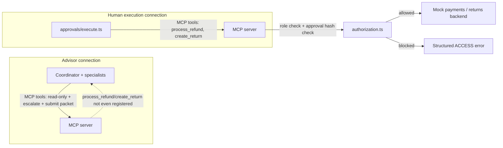
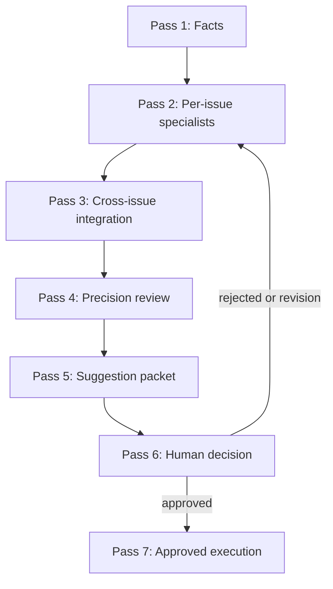

# Track 2 architecture

## Overview

Track 2 is a human-in-the-loop support advisor: it analyzes a case, retrieves
authorized data through MCP tools, evaluates policy, and produces a
versioned, hash-stamped **suggestion packet** for a human support agent to
approve, edit, or reject. The advisor never executes a customer-affecting
action. A separate, narrowly-scoped human-execution path is the only code
that can move money or change an order, and only after an exact-hash-matched
approval exists.

## The safety boundary

Two independent gates, both required:

1. **Connection-level role.** `src/agent/mcpClient.ts` always opens
   `callerRole: "advisor_agent"`. `src/mcp/server.ts` only registers a tool
   if `isToolAllowedForRole` (`src/domain/roles.ts`) allows it for that
   role — `process_refund`/`create_return` are never even listed on an
   advisor connection. `src/approvals/execute.ts` is the only code that ever
   opens `callerRole: "human_support_agent"`.
2. **Approval-hash check.** `src/mcp/authorization.ts` additionally requires,
   on the human-execution connection, an on-file approval record
   (`src/approvals/store.ts`) whose suggestion/action hash and version match
   the request exactly, that was not copied into a forked session, and that
   has not already been executed.

## Multi-pass flow

- **Pass 1 — Facts.** The advisor calls `record_case_facts` with a
  schema-validated `AdvisorCaseFacts` object
  (`src/domain/schemas/advisorCaseFacts.ts`) that tags every statement as a
  customer claim, a verified fact, a model interpretation, or an unverified
  hypothesis.
- **Pass 2 — Per-issue specialists.** `src/agent/coordinator.ts` delegates to
  Identity first, then Order + Policy in parallel (both read-only), then
  Resolution once per issue (read-only: `get_payment_history` only — it has
  no access to `process_refund`/`create_return`). Each specialist is a
  bounded nested loop (`src/agent/subagentLoop.ts`) with its own restricted
  tool allowlist.
- **Pass 3 — Cross-issue integration.** Before submitting, the advisor
  reviews all issue findings together; `src/agent/validation.ts`'s
  `validateSuggestionPacket` deterministically rejects a packet whose
  proposed actions target the same order more than once (duplicate
  compensation) — this is not left to the model's judgment alone.
- **Pass 4 — Precision review.** The same validation pass rejects an
  "eligible"/"partially_eligible" issue with zero policy citations
  (unsupported certainty), a currency mismatch, an amount exceeding the
  known refundable balance, or mismatched line-item arithmetic.
- **Pass 5 — Suggestion packet.** `submit_suggestion_packet` is one of the
  advisor's two possible terminal tools (the other is `escalate_to_human`) —
  there is no `resolve_case`/autonomous-resolution tool in this system.
- **Pass 6 — Human decision.** `src/approvals/decide.ts`: approve, edit
  (bumps the action's version/hash and invalidates approval), reject, or
  request revision.
- **Pass 7 — Approved execution.** `src/approvals/execute.ts` re-fetches
  fresh backend data and reruns arithmetic/currency/balance checks
  (`src/approvals/revalidate.ts`) immediately before calling
  `process_refund`/`create_return`.

## Session lifecycle: resume and fork

`src/sessions/index.ts` re-exports `src/agent/session.ts`'s `SessionManager`.
Resume seeds a new `AgentLoop.run()` call with a stored transcript. Fork
(`forkSession`) shares the parent's `caseId`/`traceId` for correlation but
gets its own `CaseContext` and a `readOnlySession: true` MCP connection —
side-effecting tools are refused at the MCP layer for a fork, not merely by
convention. An approval recorded from within a fork
(`src/approvals/decide.ts`'s `forkedFromSessionId` parameter) is permanently
marked non-executable in `src/mcp/authorization.ts`.

## Scratchpads and provenance

`src/sessions/scratchpad.ts` stores typed investigation notes (`verified_
insight`, `open_question`, `contradiction`, `hypothesis`, `policy_note`,
`failed_lookup`, `next_investigation_step`), each tagged `verified`,
`unverified`, `contradicted`, or `resolved`. Only `verified`/`resolved`
entries carry over to a fork. `assertSafeStatement` blocks obviously
sensitive content (passwords, SSNs, card-number-shaped strings) from ever
being written.

Every fact the advisor relies on traces to a `Provenance` entry
(`src/domain/schemas.ts`) recorded by `CaseContext.ingest` from an actual
tool call — never asserted without one. `validateSuggestionPacket`'s
citation-traceability check enforces this for policy citations specifically.

## Audit flow

`src/audit/auditLog.ts`'s `buildAuditTimeline(caseId)` aggregates the
append-only case-event log, the escalation queue's history, the suggestion
packet's version history, and the approval store's decision/execution
timestamps into one chronological view, tagging each entry as a
customer-statement-adjacent fact, an advisor analysis, a human decision, or
an execution result.

## CI governance architecture

`src/governance/deterministicChecks.ts` runs structural checks against the
live policy catalog, the permission tables, and recorded approval hashes.
`src/governance/ciReview.ts` orchestrates those checks, optionally adds a
model-assisted pass (only if the `claude` CLI is actually present on
`PATH`, checked at runtime — see `docs/ci-governance.md` for the honest
limitation here), and compares the result against
`.governance/prior-findings.json` (gitignored, regenerated each run) to
classify findings as fresh, still-active, or fixed.
